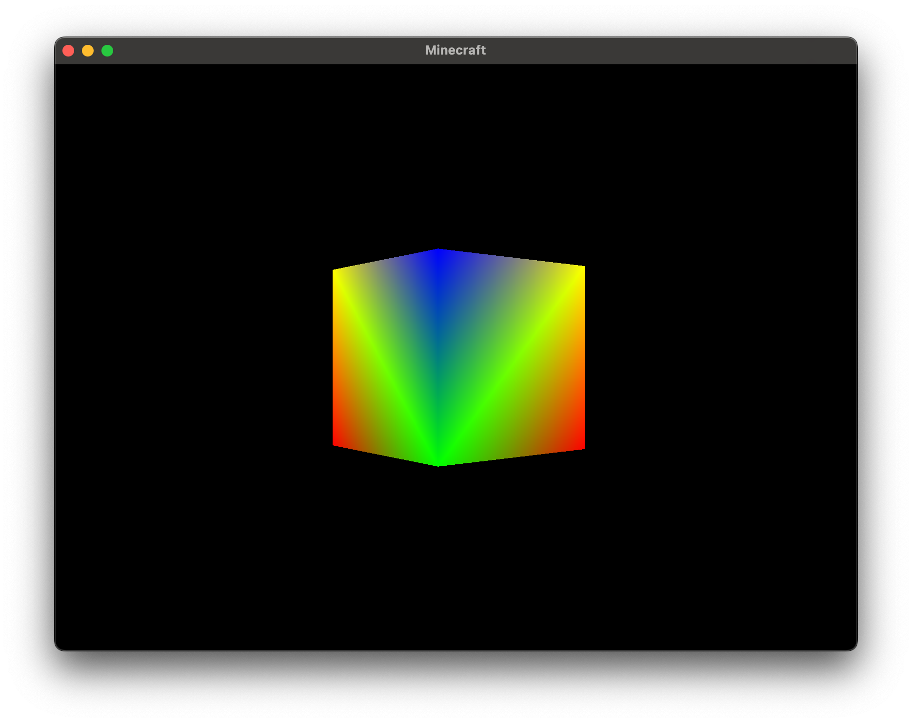
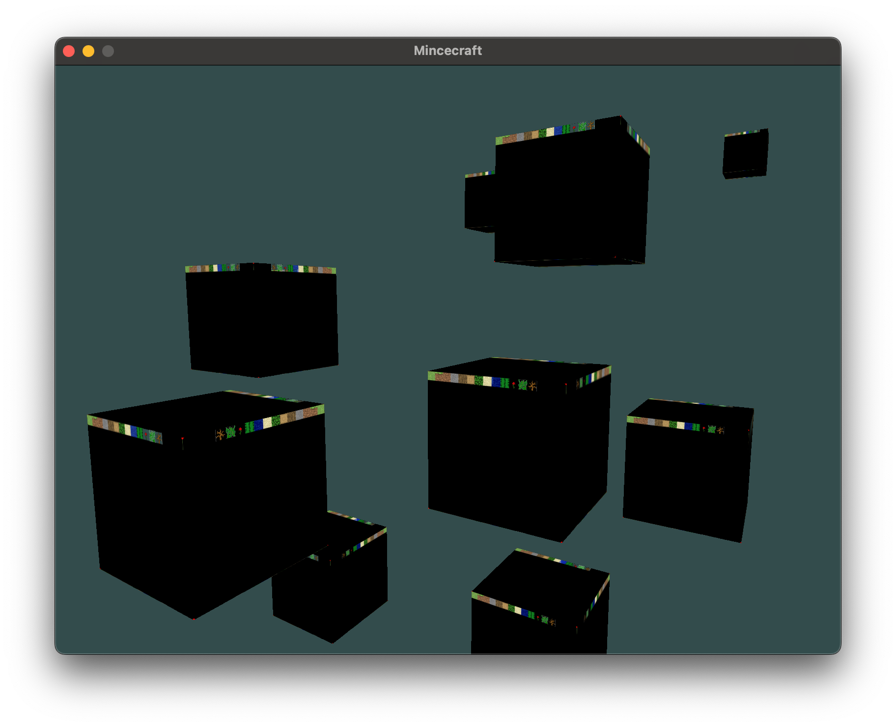
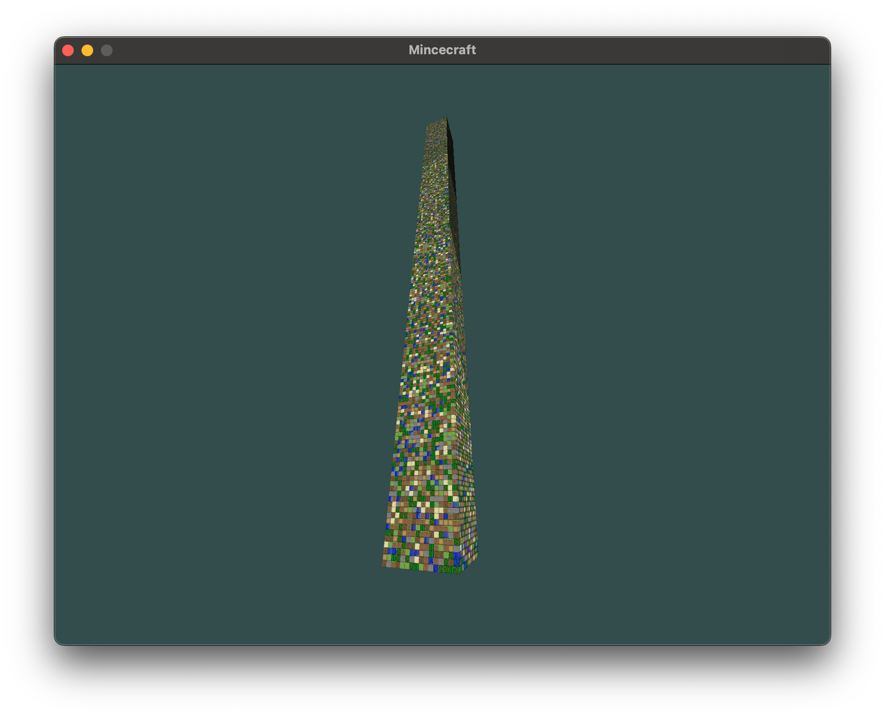
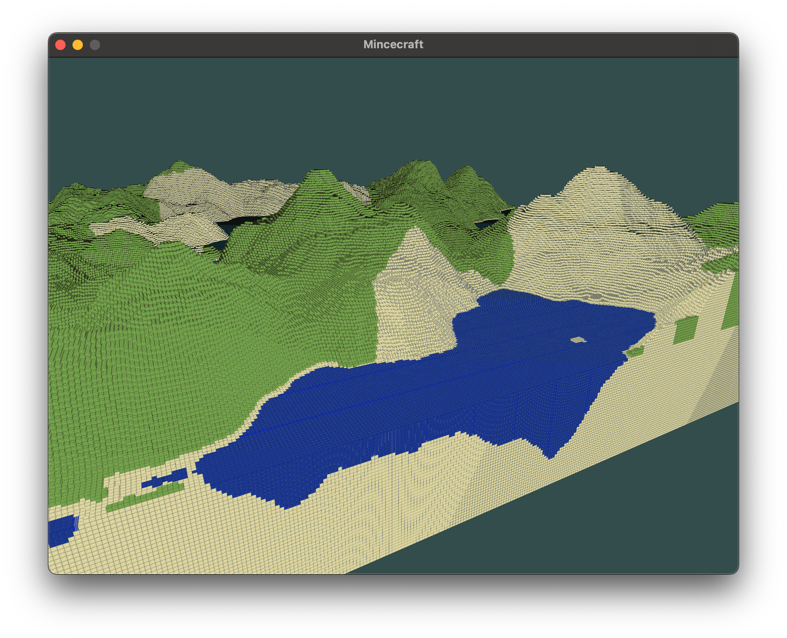
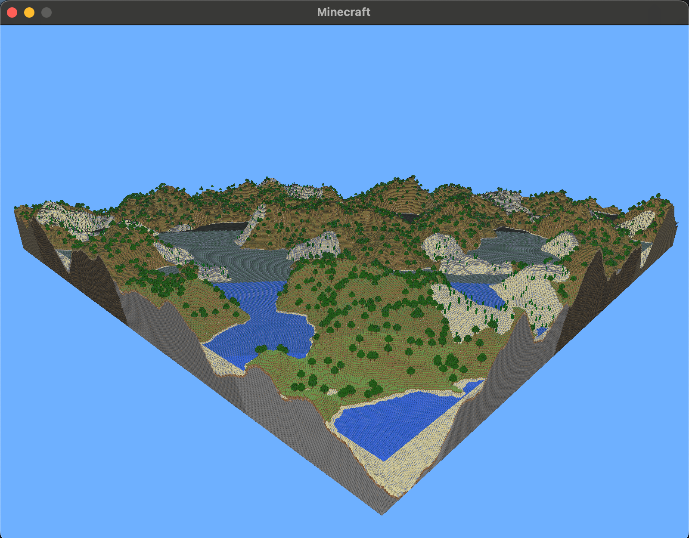
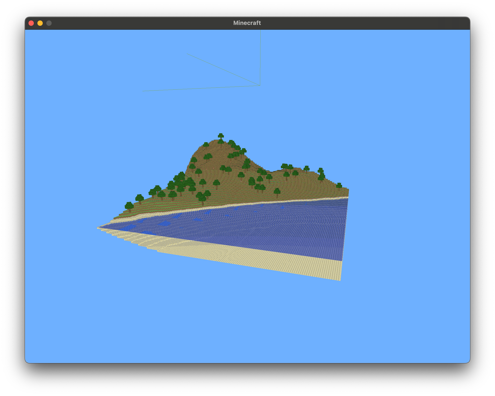

# Minecraft clone in C++
This is a simple graphics and game engine project, that implements something similar to minecraft.

> #### **_Contributions are welcome!!_**

## Installation and Setup 

1. **Vcpkg**: We are using the [Vcpkg](https://github.com/microsoft/vcpkg) package manager to install project dependencies. This project is oriented to be cross-platform, and Vcpkg provides an easy way to install packages on various operating systems.
   You can read more [here](https://vcpkg.io/en/) and [here](https://learn.microsoft.com/en-us/vcpkg/get_started/overview).

2. **Git Submodules**: You don't need to install vcpkg manually, it is included as a git submodule (shallow, depth==1). You can clone the project using the following command:
```bash
git clone --recursive --shallow-submodules https://github.com/taylor-swif/minecraft.git
```
3. **Bootstrapping Vcpkg**: After cloning the project, you can bootstrap vcpkg using the following commands:

#### MacOS/Linux:
```bash
./vcpkg/bootstrap-vcpkg.sh -disableMetrics
```

#### Windows:
```bash
./vcpkg/bootstrap-vcpkg.bat
```

4. **Install Dependencies**: Now you can install the project dependencies using the following command:
   vcpkg install glfw3 glew glad imgui

```bash
./vcpkg/vcpkg install opengl glad glew glfw3 glm imgui
```
***WARNING***

Read information's in your terminal while installing dependencies. Probably you will be missing some dependencies, so you need to install them manually.
There should be a message like this:

MacOS:
```bash
brew install libxinerama-dev libxcursor-dev xorg-dev libglu1-mesa-dev pkg-config
```

Ubuntu:
```bash
sudo apt install libxinerama-dev libxcursor-dev xorg-dev libglu1-mesa-dev pkg-config
```

Then repeat 4th step.

## Building the Project
1. **CMake**: We are using CMake to build the project. It is automated, so you do not have to do anything. 
   For example, if you are using MacOS/Linux, you can use the following command to build the project:
```bash
mkdir build
cd build
cmake ../
make all
./minecraft
```

or

Green magic button in your IDE e.g. CLion.

But for multiplatform development, I recommend using the terminal. WSL should works fine.

## Controls
- <kbd>**Esc**</kbd> - Exit
- <kbd>**W**</kbd><kbd>**A**</kbd><kbd>**S**</kbd><kbd>**D**</kbd> - Move
- <kbd>**Space**</kbd> - Jump
- <kbd>**Left Shift**</kbd> - Sprint
- <kbd>**left mouse button**</kbd> - Destroy block
- <kbd>**right mouse button**</kbd> - Place block

## Unstandard libraries

- **GLFW**: Window creation and input handling
- **GLAD**: OpenGL loader
- **GLM**: Math library
- **std_image**: Image loading library
- **Perlin noise**: Noise generation library
- **stb_image**: Image loading library

## About code

## Some screenshots from development process







##

## Credits 
- LearnOpenGL: https://learnopengl.com/
- Perlin noise library:
- Other clone: https://github.com/Hopson97/MineCraft-One-Week-Challenge

## Requirements
cmake
